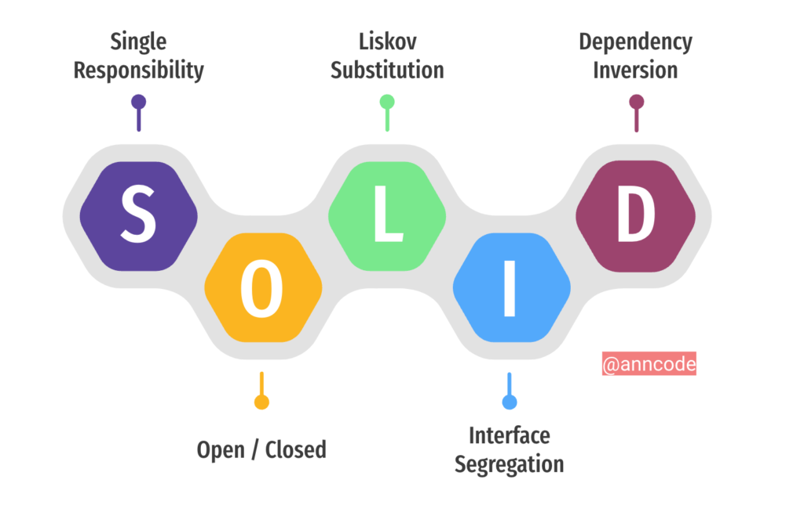

# Fuente de conocimiento
Fuente de conocimiento sobre tecnología, lenguajes de programación, frameworks, bases de datos, errores de programación, devops.

1. ### **[¿Qué es TDD?](https://ed.team/blog/que-es-el-tdd)**
   
   

<br/>

   1. **Qué significa las siglas TDD?**

      "Desarrollo Guiado por Pruebas" (Test-Driven Development en inglés)
<br/>

   1. **El principal objetivo del TDD?**

      - Mejorar la calidad del código y fomentar un desarrollo más ágil y efectivo
      - Escribir pruebas automatizadas antes de escribir el código funcional
<br/>

   1. **Que frameworks ha utilizado para implementar pruebas unitarias?**

      - JUNIT 5
      - MOCKITO
      - HAMCREST
<br/>

   1. **Diferencia entre Mock e InjectMocks?**

      @Mock crea un simulacro. @InjectMocks crea una instancia de la clase e inyecta los simulacros que se crean con el @Mock (o @Spy) anotaciones en esta instancia.

      ```java
         @Mock
         private UsuarioService usuarioService;

         @Before
         public void setUp() {
            MockitoAnnotations.initMocks(this);
         }
         ```textEn este caso, `usuarioService` se comportará como un objeto simulado que puedes configurar para que devuelva respuestas específicas a métodos llamados sobre él.

         ### Paso 2: Definición de InjectMocks
         `@InjectMocks`, por otro lado, se utiliza para crear una instancia de la clase que se está probando y, al mismo tiempo, inyecta todos los mocks que están definidos dentro del mismo contexto. Esto significa que si una clase tiene dependencias que han sido marcadas con `@Mock`, Mockito se encargará automáticamente de inyectarlas en la instancia de la clase.

         **Ejemplo de uso de @InjectMocks:**```java
         @InjectMocks
         private UsuarioController usuarioController;
         ```textAquí, `usuarioController` es la clase que estamos probando. Mockito buscará las instancias de `@Mock` en el contexto y las inyectará en el controlador automáticamente.

         ### Paso 3: Comparación y uso
         Ahora vamos a comparar estos dos conceptos:

         - **Propósito:**
         - `@Mock`: Crea un objeto simulado.
         - `@InjectMocks`: Crea un objeto real e inyecta los mocks en él.

         - **Uso:**
         - Usar `@Mock` es necesario cuando quieres simular comportamientos específicos de las dependencias.
         - Usar `@InjectMocks` es útil para probar la clase real con las interacciones de sus dependencias simuladas.

         ### Paso 4: Ejemplo completo
         Aquí hay un ejemplo más completo que ilustra su uso en una prueba de unidad:
         ```java
         @RunWith(MockitoJUnitRunner.class)
         public class UsuarioControllerTest {

            @Mock
            private UsuarioService usuarioService;

            @InjectMocks
            private UsuarioController usuarioController;

            @Test
            public void testAgregarUsuario() {
                                                      Usuario usuario = new Usuario("Juan", "juan@example.com");
               
               when(usuarioService.guardar(usuario)).thenReturn(usuario);

               Usuario resultado = usuarioController.agregarUsuario(usuario);

               assertEquals("Juan", resultado.getNombre());
               verify(usuarioService).guardar(usuario); // Verifica que el método fue llamado
            }
         }
<br/>

2. ### **[Patrones de diseño](https://refactoring.guru/es/design-patterns)**

   
<br/>

   1. **Porque son importantes los patrones de diseño?**
      1. Facilitan la Comunicación
      2. Promueven la Reutilización del Código
      3. Aumentan la Mantenibilidad
      4. Facilitan la Escalabilidad
      5. Mejoran la Eficiencia en el Desarrollo
<br/>

   1. **Explique el patrón de diseño Singleton**

      Singleton es un patrón de diseño creacional que nos permite asegurarnos de que una clase tenga una única instancia, a la vez que proporciona un punto de acceso global a dicha instancia.
      
      ```java
      package refactoring_guru.singleton.example.non_thread_safe;

      public final class Singleton {
         private static Singleton instance;
         public String value;

         private Singleton(String value) {
            // The following code emulates slow initialization.
            try {
                  Thread.sleep(1000);
            } catch (InterruptedException ex) {
                  ex.printStackTrace();
            }
            this.value = value;
         }

         public static Singleton getInstance(String value) {
            if (instance == null) {
                  instance = new Singleton(value);
            }
            return instance;
         }
      }
      
      package refactoring_guru.singleton.example.non_thread_safe;

      public class DemoSingleThread {
         public static void main(String[] args) {
            System.out.println("If you see the same value, then singleton was reused (yay!)" + "\n" +
                     "If you see different values, then 2 singletons were created (booo!!)" + "\n\n" +
                     "RESULT:" + "\n");
            Singleton singleton = Singleton.getInstance("FOO");
            Singleton anotherSingleton = Singleton.getInstance("BAR");
            System.out.println(singleton.value);
            System.out.println(anotherSingleton.value);
         }
      }
<br>

   1. **Indique el patrón de inyección de dependencia**

      Este consiste en insertar dependencias a otra clase mediante constructor.

      ```java
      public class Coche {
         private Motor motor;
         // Inyección por método
         public void setMotor(Motor motor) {
            this.motor = motor;
         }
      }

      @RequiredArgsConstructor
      public class Coche {
         // Inyección por método con anotación de lombok
         private final Motor motor;
      }

<br/>

   1. **Enumere y explique otros patrones de diseño**
      1. Builder
      2. Facade
      3. Circuit Breaker
      4. Adapter
      5. Strategy
<br/>

1. **Arquitectura de aplicaciones**
   1. **Explique la arquitectura MVC**
   
   
<br/>

   2. **Explique la arquitectura de microservicios**

   
<br/>

   1. **Explique la arquitectura limpia (clean architecture)**
      1. La arquitectura limpia es aquella en la que todas las capas que componen el software son independientes unas de otras de manera que, a la hora de ampliar las funcionalidades de un proyecto o cambiar un componente por otro, no haya conflicto y este cambio se realice con el menor coste de tiempo posible.
<br/>

   1. **Explique la arquitectura event driver**
      1. Es un patrón popular de arquitectura asíncrona distribuida, que se utiliza para producir aplicaciones altamente escalables. Es altamente adaptable y puede usarse en aplicaciones pequeñas, grandes y complejas. La arquitectura Event-Drive está compuesta de eventos altamente desacoplados y de un solo propósito.
<br/>

1. **Base Datos**
   
<br/>

   1. **Diferencia bdd relacional y no relacional**
      1. Como su propio nombre indica, las bases de datos no relacionales son las que, a diferencia de las relacionales, no tienen un identificador que sirva de relación entre un conjunto de datos y otros.
<br/>

   2. **Cuales son los objetos mas importantes de las BD relacionales**
      1. tablas, procedimientos almacenados, triggers, vistas, indices.
<br/>

   1. **Que es un indice cluster, no cluster y para que sirven.**
      1. Los índices son estructuras de datos que se utilizan en bases de datos para acelerar el proceso de búsqueda y recuperación de información.

         ##### Índice Agrupado (Cluster)
         **Definición:** Un índice agrupado es como el orden físico de las filas en una tabla. Es decir, determina el orden en que los registros se almacenan físicamente en el disco.
         **Función:** Su principal función es optimizar las consultas que se realizan sobre la columna o columnas que componen el índice. Al estar los datos ordenados según el índice, las búsquedas secuenciales son muy rápidas.
         **Características:**
         Solo puede haber un índice agrupado por tabla.
         El orden del índice agrupado determina el orden físico de los datos.
         Generalmente, la clave principal de una tabla se define como un índice agrupado.

         ##### Índice No Agrupado (No Cluster)
         **Definición:** Un índice no agrupado es una estructura de datos separada de la tabla principal. Contiene un conjunto de punteros que apuntan a las filas de la tabla que coinciden con los valores del índice.
         **Función:** Su objetivo es mejorar el rendimiento de las consultas que se realizan sobre columnas que no forman parte del índice agrupado. Al igual que un índice de libro, nos permite localizar rápidamente los registros relevantes.
         **Características:**
         Se pueden crear múltiples índices no agrupados por tabla.
         Los datos no están ordenados físicamente según el índice no agrupado.
         Son útiles para columnas que se utilizan frecuentemente en cláusulas WHERE de las consultas.

   2. **Haz usado alguna bd no relacional, cual y para que**
      1. Redis, MongoDB
1. ### **[Principios SOLID](https://ed.team/blog/que-son-los-principios-solid-en-programacion-la-mejor-explicacion-en-espanol)**

      

      S: Principio de responsabilidad única (Single Responsibility Principle - SRP).
      O: Principio de Abierto / Cerrado (Open/Closed Principle - OCP).
      L: Principio de sustitución de Liskov (Liskov Substitution Principle - LSP).
      I: Principio de segregación de interfaces (Interface Segregation Principle - ISP).
      D: Principio de inversión de dependencias (Dependency Inversion Principle - DIP)
<br/>

   1. **¿A que hace referencia el principio de responsabilidad unica?**
   
      El Principio de Responsabilidad Única dice que una clase debe hacer una cosa y, por lo tanto, debe tener una sola razón para cambiar.
<br/>

   2. **¿A que hace referencia el principio de abierto y cerrado?**
   
      El principio de apertura y cierre exige que las clases deban estar abiertas a la extensión y cerradas a la modificación.
<br/>

   3. **¿A que hace referencia el principio de Substitución de Liskov?**
   
      El Principio de Sustitución de Liskov establece que las subclases deben ser sustituibles por sus clases base.
<br/>

   4. **¿A que hace referencia el principio de segregación de interface?**
      
      La segregación significa mantener las cosas separadas, y el Principio de Segregación de Interfaces se trata de separar las interfaces.
<br/>

   5. **¿A que hace referencia el principio de de inversión de dependencia?**

      El principio de inversión de dependencia establece que nuestras clases deben depender de interfaces o clases abstractas en lugar de clases y funciones concretas.
<br/>

2. **Framework**
   1. **Spring Framework vs Springboot**
      1. **Configuración**
        **Spring Framework:** Requiere mucha configuración. Por lo general, los desarrolladores deben configurar mucho manualmente, desde el archivo web.xml hasta los archivos de configuración Java y XML. Esto puede llevar tiempo y puede ser propenso a errores.
        **Spring Boot:** Utiliza una configuración automática. Esto significa que, al agregar en tu proyecto ciertas dependencias, Spring Boot automáticamente configura los beans y componentes necesarios sin necesidad de intervención manual.

      2. **Dependencias**
        **Spring Framework:** Necesitas gestionar manualmente las dependencias del proyecto. Esto incluye la versión de las bibliotecas y cómo se integran entre sí.
        **Spring Boot:** Utiliza "starters", que son conjuntos de dependencias recomendadas. Por ejemplo, spring-boot-starter-web incluye todas las dependencias necesarias para construir aplicaciones web. Esto simplifica enormemente la gestión de dependencias.

      3. **Inicialización del Proyecto**
        **Spring Framework:** Para empezar un proyecto, generalmente se crea una estructura de proyecto desde cero, lo cual puede ser tedioso.
        **Spring Boot:** Proporciona Spring Initializr (un generador en línea) que permite crear un proyecto Spring Boot completo con todas las dependencias y configuraciones esenciales en pocos clics.
      
      4. **Implementación de Microservicios**

        **Spring Framework:** Aunque es posible construir microservicios, la configuración y la integración de componentes puede ser compleja y consumir mucho tiempo.

        **Spring Boot:** Está optimizado para desarrollar microservicios. Soporta funcionalidades como Actuator y Spring Cloud, que simplifican la gestión y escalabilidad de microservicios.
        <br/>
        
        <br/>

    1. **Seguridad Aplicación**
       1. **Qué es un Autorization Server?**
            Un servidor que autentica al usuario y emite un access token temporal para un ámbito (scope) definido por el propietario del recurso.
        <br/>
        
         1. **¿Como asegurarias un EndPoint?**
            1. **Tokens de autenticación**: Implementar tokens como JWT (Json Web Tokens) que se envían con cada solicitud.
            2. **OAuth2**: Un protocolo que permite a las aplicaciones acceder a recursos sin compartir credenciales.
        <br/>

         1. **En que consiste  JWT**

            JWT (JSON Web Token) es un estándar qué está dentro del documento RFC 7519.
            En el mismo se define un mecanismo para poder propagar entre dos partes, y de forma segura, la identidad de un determinado usuario, además con una serie de claims o privilegios.
            Estos privilegios están codificados en objetos de tipo JSON, que se incrustan dentro del payload o cuerpo de un mensaje que va firmado digitalmente.
        <br/>

         1. **Cual es la estructura del JWT**

            Header, payload y signature
        <br/>

    1. **Verbos HTTP ( Get, Post, Put,Patch)**
        1. **¿Cuales son considerados métodos seguros en HTTP y por que?(GET)**

            Un método HTTP es seguro cuando no altera el estado del servidor. En otras palabras, un método HTTP es seguro solo cuando ejecuta una operación de lectura.
        <br/>

        1. **Un método get puede contener un cuerpo**
            
        <br/>

        2. **Cuál es la diferencia entre PUT y PATCH**

            El método HTTP PATCH aplica modificaciones parciales a un recurso.
            El método HTTP PUT únicamente permite reemplazar completamente un documento. 
            A diferencia de PUT , el método PATCH no es idempotente, esto quiere decir que peticiones identicas sucesivas pueden tener efectos diferentes.
        <br/>
        
        1. **El http status code 500 que representa**

            El mensaje de error HTTP 500 indica que se ha producido un problema en el servidor web que hospeda el sitio web en el momento en que se devuelve el error.
        <br/>

         2. **Cors, Cross Domain**

            El intercambio de recursos de origen cruzado (CORS) es un mecanismo de navegador que permite el acceso controlado a recursos ubicados fuera de un dominio determinado.
            <br/>

         3. **¿Para que sirve CORS?(Mecanismo de de seguridad a nivel de peticiones HTTP)**

            CORS protege de que sitios maliciosos interactúen con sitios legítimos.

   2. **Persistencia de Datos**
      1. **Modelamiento ¿Que tipos de relaciones existen entre entidades de bdd con JPA?(One to One, One to Many, Many to One,Many to Many)**
         1. One to One
         2. One to Many, Many To One
         3. Many to Many
    <br/>

      2. **Object relational mapping - ORM**

         Es una herramienta que nos permite mapear, o lo que es lo mismo, convertir los objetos de tu aplicación a un formato adecuado para ser almacenados en cualquier base de datos, creándo para ello una base de datos virtual donde los datos disponibles en nuestra aplicación quedan vinculados con la base de datos final.
         <br/>

         1. **Para que sirve un ORM?**

            Permite mapear las estructuras de una base de datos relacional (SQL Server, Oracle, MySQL, etc.) sobre una estructura lógica de entidades con el objeto de simplificar y acelerar el desarrollo de nuestras aplicaciones.
            <br/>

         2. **¿Que motores de persistencia maneja Spring nativamente?**

            JPA
            <br/>

      3. **Herencias ¿Como identificaria si en un modelo de clases aplica herencia (ejemplo)?**
         1. **Qué conoce como herencia simple?**
            La herencia simple es un concepto fundamental en programación orientada a objetos (POO) que se refiere a la capacidad de una clase (llamada clase hija o subclase) de heredar atributos y métodos de otra clase (llamada clase padre o superclase). Este mecanismo permite reutilizar código, así como establecer una relación jerárquica entre las clases.

            ```java
            // Clase Padre
            public class Animal {
                private String especie;

                // Constructor
                public Animal(String especie) {
                    this.especie = especie;
                }

                // Método para hacer sonido
                public void hacerSonido() {
                    System.out.println("Sonido de un animal genérico");
                }

                // Método para obtener la especie
                public String getEspecie() {
                    return especie;
                }
            }

            ```java
            // Clase Hija
            public class Perro extends Animal {
                private String nombre;

                // Constructor
                public Perro(String nombre) {
                    super("Perro");  // Llama al constructor de la superclase
                    this.nombre = nombre;
                }

                // Sobreescritura del método hacerSonido
                @Override
                public void hacerSonido() {
                    System.out.println("Guau! Soy " + nombre);
                }

                // Método para obtener el nombre
                public String getNombre() {
                    return nombre;
                }
            }
        <br/>

         2. **Qué conoce como herencia múltiple?**
            N/A
        <br/>

      4. **Excepciones ¿Que tipos de excepciones conoce en JAVA?**
         1. **Excepciones de tipo Checked**
            Se podría traducir como Excepciones Controladas. Éstas excepciones son verificadas en tiempo de compilación. Lo que se valida es si en código se han manejado dichas excepciones o no.

            ```java
            import java.sql.*;

            public class ConectarBaseDatos {
                public static void main(String[] args) {
                    Connection conexion = null;
                    try {
                        conexion = DriverManager.getConnection("jdbc:mysql://localhost:3306/mibase", "usuario", "contraseña");
                        System.out.println("Conexión exitosa!");
                    } catch (SQLException e) {
                        System.out.println("Error al conectar a la base de datos: " + e.getMessage());
                    } finally {
                        if (conexion != null) {
                            try {
                                conexion.close();
                            } catch (SQLException e) {
                                e.printStackTrace();
                            }
                        }
                    }
                }
            }

        <br/>
         2. **Excepciones de tipo Unchecked**
            Éstas son las excepciones no controladas o mejor conocidas como Runtime Exceptions. Dichas excepciones ocurren en tiempo de ejecución y son ignoradas en tiempo de compilación.
            
            String text = null;
            int length = text.length(); // Esto lanzará un NullPointerException